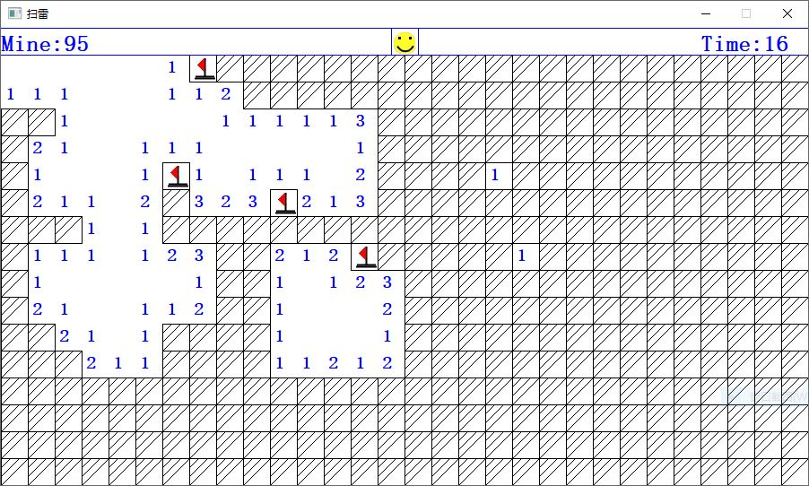

扫雷游戏
==================

由于win10系统上取消了扫雷游戏, 因此使用C++语言自行开发了一个扫雷游戏. 通过此游戏的开发, 一方面练习了C++的使用, 另一方面又可以愉快的体验扫雷游戏. 项目使用ACLLib作为图形库, 该图形库使用WIN32 API编写, 因此本游戏理论上可以在所有Windows平台运行(目前仅在win10平台上测试).

软件运行图
-------------

与经典的扫雷游戏的界面一样, 操作也完全相同,支持左键点击, 右键标记,以及同时左右键快速翻开操作. 点击中间的笑脸可以重新开局. 

游戏过程中如果出现错误, 会自动标记所有的雷, 标记错误的雷也有特殊的提示. 

翻开所有非雷区域, 即可获得游戏胜利. 同样, 点击中间的笑脸可以重新开局.

在游戏过程中输入字符 `n` 可以开始新游戏, 输入字符 `r` 可以重开本局游戏. 

此外游戏中还内置了一个秘籍, 可以探测指定位置周围的雷, 欢迎查看源代码寻找秘籍. 

编译方法
---------------
本系统采用Visual Studio 2017开发, 因此使用Visual Studio打开此项目并进行编译即可开始游戏

协议
-------------

本游戏中包括代码和图像资源等全部内容, 使用MIT协议.

依赖库
----------------

项目使用了以下开源项目, 向各位作者表示感谢
- [ACLLib](https://github.com/wengkai/ACLLib)

